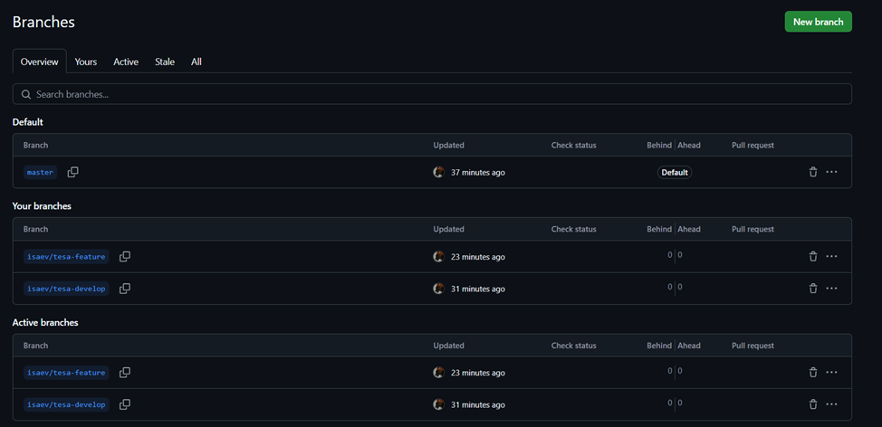
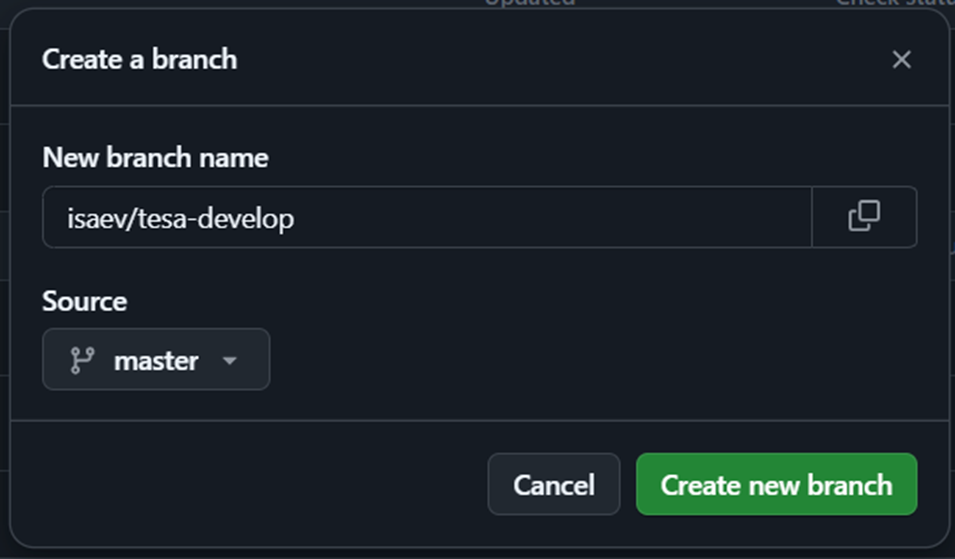
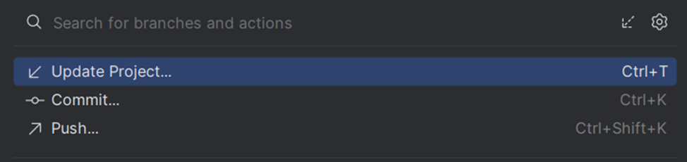
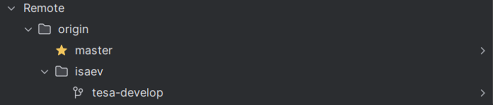
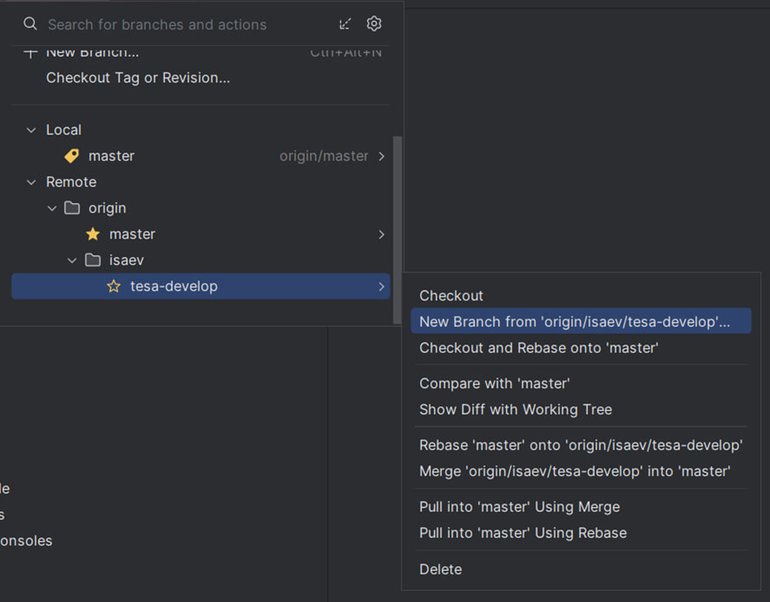

# Git Flow

**Git Flow** — это популярная методология работы с ветками в Git, предложенная Винсентом Дриссеном. Она структурирует процесс разработки и упрощает управление версиями кода.

## Основные ветки:

1. **`main`**:
   - Стабильная версия кода, готовая для продакшн-релизов.
   - Каждая версия, которая развёртывается, фиксируется здесь.

2. **`develop`**:
   - Основная ветка для разработки. Здесь сливаются все новые функции, прежде чем попасть в `main`.

## Дополнительные ветки:

1. **`feature/*`**:
   - Используются для разработки новых функций.
   - Ветки создаются от `develop` и сливаются обратно туда после завершения работы.

2. **`release/*`**:
   - Создаются для подготовки нового релиза.
   - Ветка от `develop`, затем сливается в `main` и `develop` (если были правки).

3. **`hotfix/*`**:
   - Используются для срочного исправления критических багов в продакшн-коде.
   - Создаются от `main`, затем сливаются обратно в `main` и `develop`.

## Процесс:

1. Разработка новой функции начинается в ветке **`feature/*`**.
2. После завершения функции — слияние в **`develop`**.
3. Подготовка релиза из ветки **`release/*`**.
4. Срочные исправления через ветку **`hotfix/*`**.

## Пояснение терминов:

1. **Recent** — это список веток или репозиториев, с которыми ты недавно работал.
2. **Local** — это локальные ветки, хранящиеся на твоем компьютере. Ты можешь редактировать и работать с ними локально.
3. **Remote** — это удалённые ветки, которые хранятся на сервере (например, GitHub, GitLab).

---

# Git Guidelines

## Шаги для работы с ветками:

1. После того как вы клонировали проект себе, нужно сделать ветку от `main`. Есть два способа — через IDE или в GitHub. Покажу оба варианта.
   - Чтобы сделать это через GitHub, пройдите по [этой ссылке](https://github.com/Torvalds1703/tesa-main).
      
2. Для создания своей **`develop`** ветки, нажмите **New branch**: 
    
    
 
3. **Хорошей практикой** будет придерживаться единого стиля в названии папок и веток. Следуйте примеру: 
    
    
 
4. Далее перейдите в IDE и нажмите **Update Project**. Ветка, которую вы отбранчевали, должна загрузиться и отобразиться. 
    
    
 
   В **remote** должна появиться папка с вашей фамилией и веткой `develop`. 
 
    
 
5. Теперь рассмотрим, как сделать ветку в IDE. Для этого нужно нажать правой кнопкой мыши на ветку **`develop`**: 
 
    
 

6. Создайте **feature** ветку — **фамилия/tesa-feature**. После этого можно либо сразу запушить фича-ветку в удалённый репозиторий, либо после внесения изменений — на ваше усмотрение.